# Automa Workflow - Twitter Interaction Flow

## Visual Flowchart

```mermaid
flowchart TD
    Start([Trigger: Workflow Start]) --> BG1_Start

    subgraph BG1 [Block Group 1: Initial Setup]
        BG1_Start[Open New Tab] -->|URL: x.com/iiiccceeeman/status/2018923665639842203| BG1_Delay[Delay]
        BG1_Delay --> BG1_Click[Click Element: Status Input]
        BG1_Click --> BG1_Screenshot[Take Screenshot]
    end

    BG1_Screenshot --> BG2_Start

    subgraph BG2 [Block Group 2: Type Tweet Content]
        BG2_Start[Press Keys: Type Message]
    end

    BG2_Start --> BG3_Start

    subgraph BG3 [Block Group 3: Post & Engage]
        BG3_Start[Click: Tweet Button] -->|Submit Tweet| BG3_Delay[Delay]
        BG3_Delay --> BG3_Like[Click: Like Tweet]
        BG3_Like --> BG3_Retweet[Click: Retweet Button]
        BG3_Retweet --> BG3_Quote[Click: Quote Retweet Button]
    end

    BG3_Quote --> BG4_Start

    subgraph BG4 [Block Group 4: Type Quote Content]
        BG4_Start[Press Keys: Type Quote Message]
    end

    BG4_Start --> BG5_Start

    subgraph BG5 [Block Group 5: Submit Quote Retweet]
        BG5_Start[Click: Retweet Button] -->|Submit Quote| BG5_Delay[Delay]
    end

    BG5_Delay --> BG6_Start

    subgraph BG6 [Block Group 6: Navigate to User Profile]
        BG6_Start[Click: User Cell] -->|Navigate to Profile| BG6_Follow[Click: Follow Button]
        BG6_Follow --> BG6_Message[Click: Message Button]
    end

    BG6_Message --> BG7_Start

    subgraph BG7 [Block Group 7: Type Direct Message]
        BG7_Start[Press Keys: Type DM Content]
    end

    BG7_Start --> BG8_Start

    subgraph BG8 [Block Group 8: Send Message]
        BG8_Start[Click: Submit Message Button]
    end

    BG8_Start --> End([Workflow Complete])

    style Start fill:#4CAF50,color:#fff
    style End fill:#f44336,color:#fff
    style BG1 fill:#E3F2FD
    style BG2 fill:#F3E5F5
    style BG3 fill:#E8F5E9
    style BG4 fill:#FFF3E0
    style BG5 fill:#FCE4EC
    style BG6 fill:#E0F2F1
    style BG7 fill:#F1F8E9
    style BG8 fill:#FBE9E7
```

---

## Workflow Breakdown

### 🎯 Trigger
The workflow starts with an initial trigger event.

### 📋 Block Group 1: Initial Setup
**Purpose:** Navigate to the target tweet and prepare for interaction
1. **Open New Tab** - Navigates to specific tweet URL
2. **Delay** - Waits for page to load
3. **Click Element** - Focuses on the status/reply input field
4. **Take Screenshot** - Captures the current state

### ⌨️ Block Group 2: Type Tweet Content
**Purpose:** Enter the reply/tweet content
- Uses keyboard input to type the message

### 🐦 Block Group 3: Post & Engage
**Purpose:** Submit the tweet and interact with the original post
1. **Click Tweet Button** - Submits the reply
2. **Delay** - Waits for tweet to post
3. **Like Tweet** - Likes the original tweet
4. **Click Retweet Button** - Opens retweet menu
5. **Click Quote Retweet** - Selects quote retweet option

### ✍️ Block Group 4: Type Quote Content
**Purpose:** Enter the quote retweet message
- Types the quote message content

### 🔄 Block Group 5: Submit Quote Retweet
**Purpose:** Publish the quote retweet
1. **Click Retweet Button** - Submits the quote
2. **Delay** - Waits for action to complete

### 👤 Block Group 6: Navigate to User Profile
**Purpose:** Visit the user's profile and initiate messaging
1. **Click User Cell** - Navigates to the user's profile page
2. **Follow Button** - Follows the user
3. **Message Button** - Opens the direct message interface

### 💬 Block Group 7: Type Direct Message
**Purpose:** Compose the direct message
- Types the DM content

### 📨 Block Group 8: Send Message
**Purpose:** Send the direct message
- Clicks the submit button to send the DM

---

## Summary
This workflow automates a complete Twitter interaction sequence: replying to a tweet, engaging with it (like, quote retweet), following the author, and sending them a direct message. The workflow includes strategic delays to allow for page loads and action completions.
